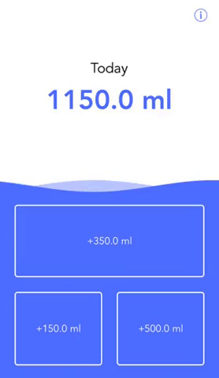
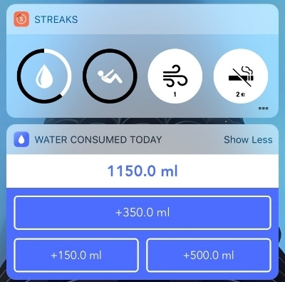

Recently, I released Drip, an iOS app designed to make it as convenient as possible to log the water you drink. If you'd like more info on Drip you can view the product page, or check it out on the App Store. Here I just wanted to give some background on where need for a tool like Drip came from and how I use it.

Lately I’ve been using the awesome iOS app Streaks to build a few daily habits. For those who don't know, Streaks lets you set a list of tasks that you want to complete every day, with the goal of building a streak of days that you complete these tasks. I've found it really helpful in gamifying otherwise mundane habits. After a few weeks being more dehydrated than usual, I created a Streaks goal of drinking 3L (about 13 cups) of water per day. Streaks integrates HealthKit which means that if I logged my water consumption in HealthKit, Streaks can automatically track whether I completed by goal of 3L per day. 

Now I needed was a water tracking app that met a few conditions:
- Integrated with HealthKit
- Convenient as possible to log a beverage (i.e. 1-2 taps to log a beverage)
- Had a Today Widget (even more convenient entry)
- Did not require an account (you’d think water tracking apps wouldn’t require accounts, you’d be wrong 🙄)
- Had preset drink sizes (I mostly drink water from the same 2 bottles)

At the time I looked (early January, 2018), no app existed that covered my needs. So I did what every foolishly overconfident developer does when none of the existing tools suit the task: build it myself.

That’s what Drip is. A fast way to log daily water consumption in HealthKit. It has three customizable drink sizes to match the containers you regularly use. In regular use, almost exclusively use the Today Widget.

It definitely won’t be for everyone. If you want notifications to remind you to drink water, or fancy charts tracking you consumption over time, Drip is not for you. I’d highly recommend Waterminder (iOS & Android). It has all the bells and whistles a water tracking app could have while maintaining a clean interface.