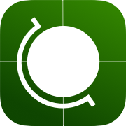
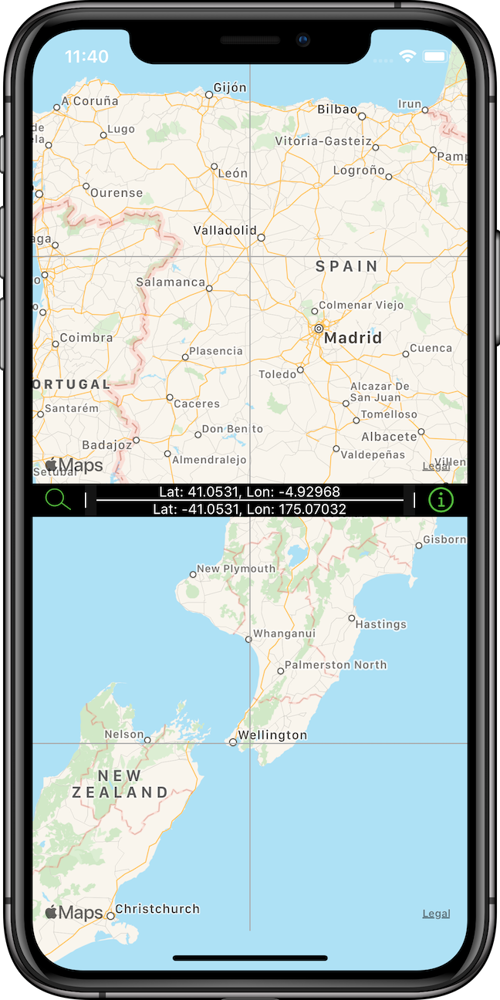

 

An­it­podes is a ba­sic iOS ap­pli­ca­tion for view­ing and com­par­ing an­tipodes on Earth. An an­tipode of any spot on Earth, is the point on the Earth's sur­face di­a­met­ri­cal­ly op­po­site to it.

While the app is fun to play around with for a few minutes, it doesn't really serve any practical purpose (turns out a **lot** of the Earth is covered by water). I developed Antipodes over a weekend, mostly to play around with MapKit APIs. 

