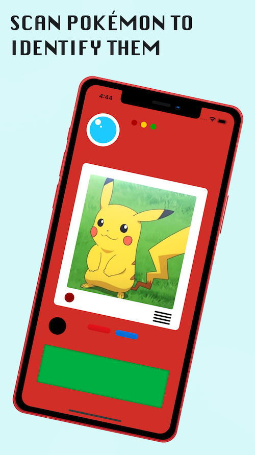
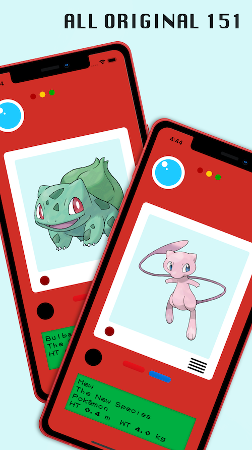

Ash's Pokédex is a fan recreation of the Pokédex Ash used in the original Pokémon TV series. Ash's Pokédex has all the same features as the Pokédex from the show:

 - Scan Pokémon to identify them
 - Have Pokédex entries read out loud
 - Read additional Pokémon info on screen
 - Supports all original 151 Pokémon

The Pokédex in the Pokémon TV show was really magical. In the era before smartphones, or even iPods, it felt like such an honor to entrust a kid with this high tech gadget to take on their Pokémon journey. Each new Pokémon Ash encountered, the Pokédex would explain to Ash (and me) what the Pokémon was and what made it special. The whole thing was just so seamless. Ash just opened it up, and it immediately identified the Pokémon, gave Ash the info he needed, and the show moved on.

Ash's Pokédex mostly demostrates the crazy technological progress that has happened since the Pokédex was first on screen in 1997. What, at the time, seemed just as magical as the rest of Pokémon, is now possible on devices everyone has. Ash's Pokédex uses a machine learning library compiled with Tensorflow to identify Pokémon using the iPhone's camera. It then use's iOS's speech synthesizer to speak the entry for the Pokémon aloud. Finally, for some added texture, the buttons and bezels in the app have a parallax effect, to make them seem 3D. Ash's Pokédex cannot capture the magic of the Pokédex from the TV series, but it does encapsulate the speed of technological progress from our childhoods to the present.

Ash's Pokédex's image recognition is powered by a Tensorflow image classifier I built named [pokedex-tensorflow](https://github.com/kgenoe/pokedex-tensorflow). The data used to train the model was sourced [here](https://www.kaggle.com/lantian773030/pokemonclassification), and was compiled by Lance Zhang. The model was built using standard image classification training techniques:
 - images were resized to a unified size, and rescaled to remove colour 
 - used transfer learning from MobileNetV2
 - image augmentation (random flips & rotations) to increase the the size of limited dataset
 - model trained over 20 epochs

The resulting keras model was exported as a CoreML model using coremltools. For comparison's sake, I also used the same dataset to train a model using Apple's CreateML tool. The CreateML model also trained over 20 epochs, using similar image augmentation techniques, performed noticably worse than the tensorflow model. I assume this difference is primarily due to the transfer learning from MobileNetV2 that was possible with tensorflow.

Pokémon and All Respective Names are Trademark & © of Nintendo 1996-2020.

