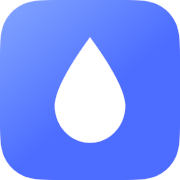
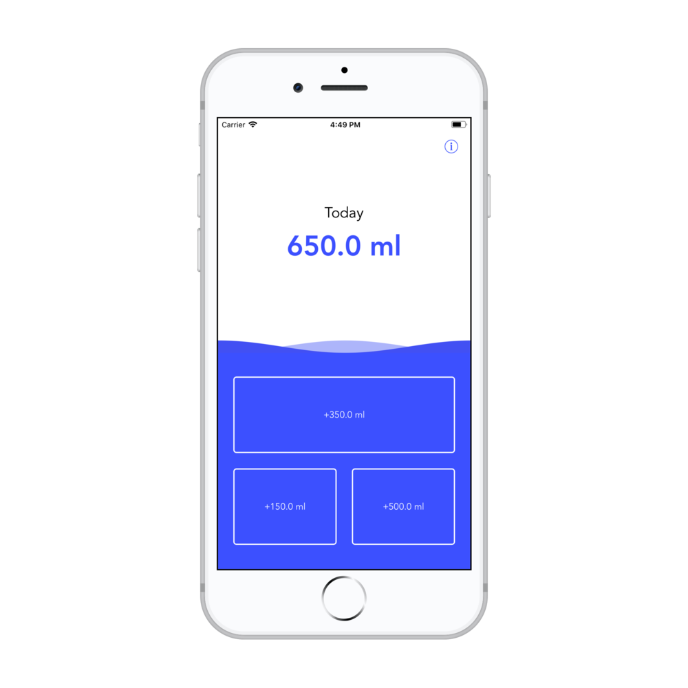
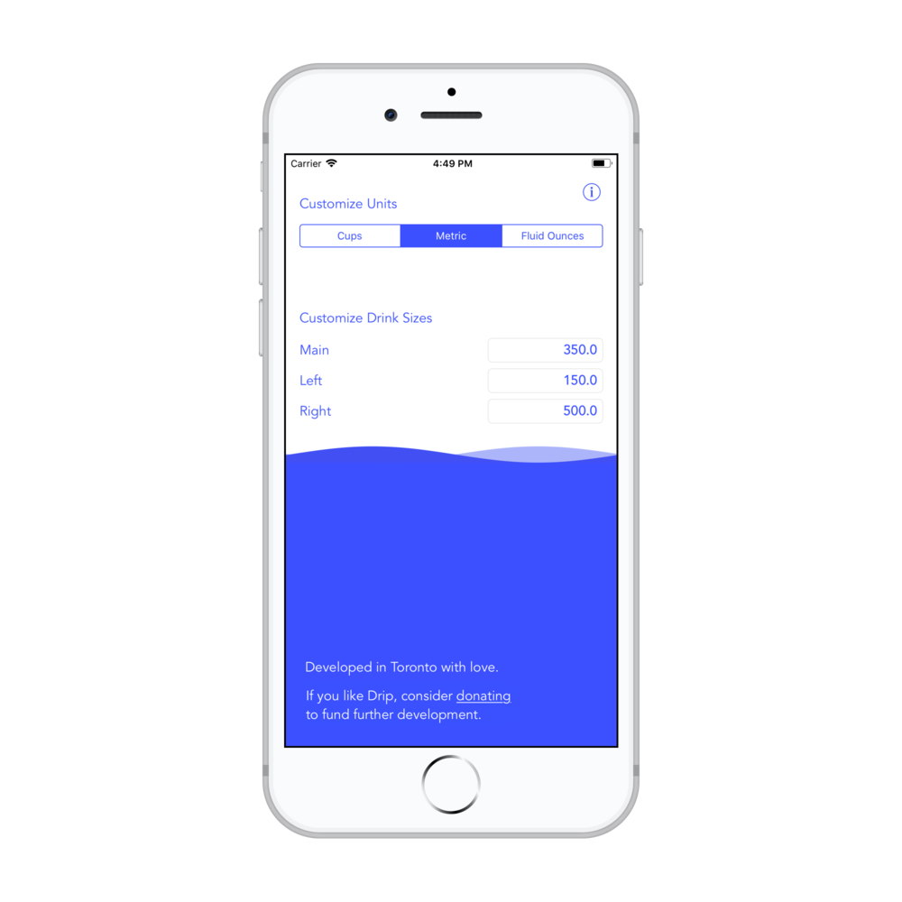

 

Drip was an app developed by me in 2018. It's purpose was to encourage me to drink water my keeping track of the amount I drank each day. It worked great, but I was able to replace it's use case with a Siri Shortcut (specifically in the Today Widget). Because of this, it's development has stopped.

 

Drip is a simple way to log the water you drink. No account required, no annoying reminders, no excessive charts; just record each glass of water and get on with your life.

The goal of Drip was to make it as frictionless as possible to record water as you drink it. Drip has three buttons for three different drink sizes that you can customize to match the containers you commonly use. Recording a drink is as simple as opening the app or widget and hitting a single button. It’s surprisingly easy to build the habit of hitting the button as soon as you finish your drink.

#### Features

- Customizable drink sizes
- Measure in cups, millilitres, or fluid ounces
- Today widget
- HealthKit integration
- No account required

 