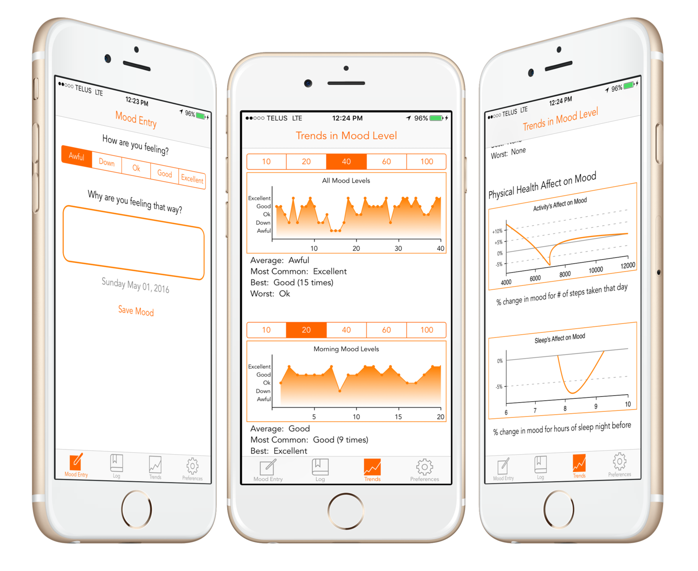

Mood is an emotional health tracking app. It allows a user to periodically input their current mental state (or mood) into the app, along with a note explaining the context around their mental state. Users can then see a log of all their previously entered moods, as well as trends in their mood past moods. Finally the user can opt-in to be notified periodically, either randomly or on a set schedule, to enter their mood. Mood was developed with the intention of eventually being connected with iOS’s HealthKit framework. This would allow trends in emotional health to be linked to all the data collected by HealthKit including sleep analysis, daily activity, body weight, and more.

