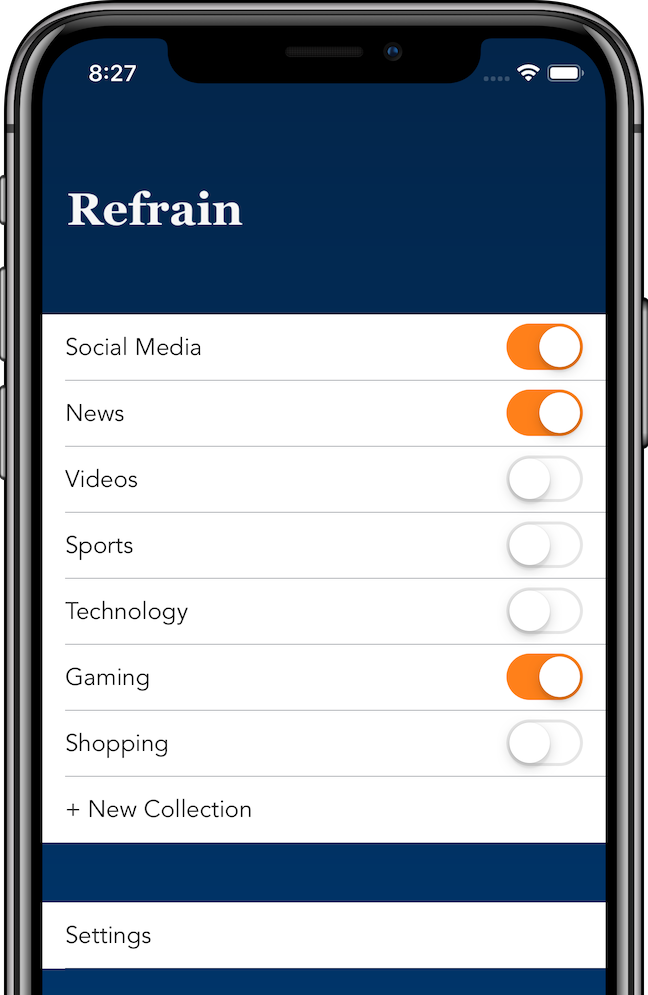
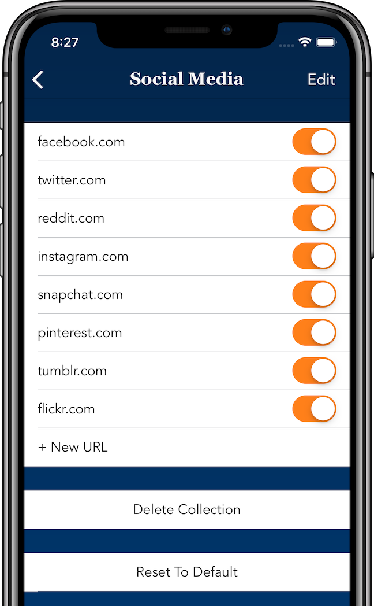
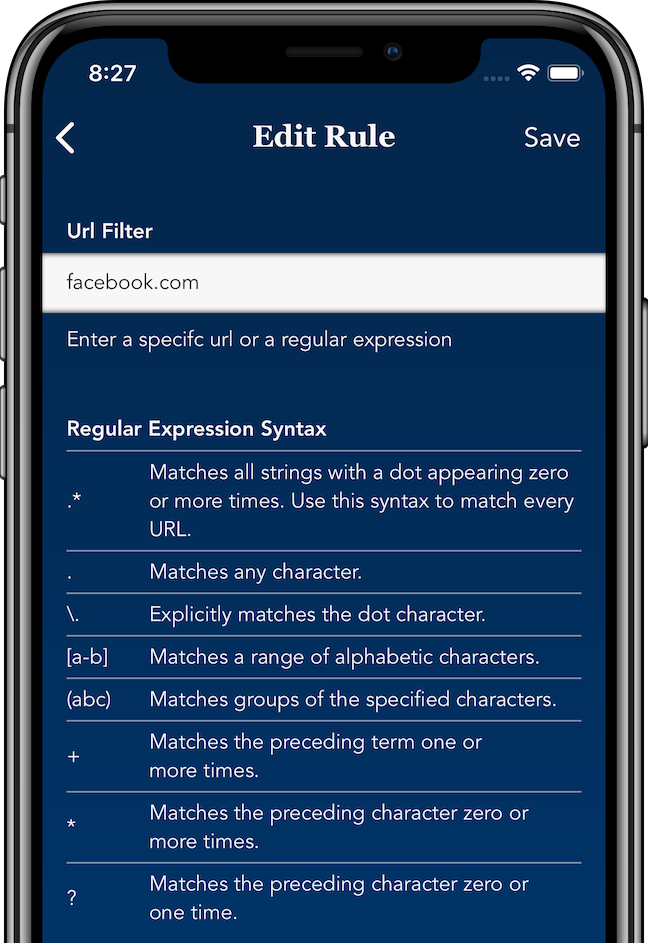

#### Block Unhelpful Websites
Refrain is meant to be used to block unhelpful websites from your device. That can mean different things to different people, but here are some suggestions on how to use it effectively:

- Block distracting websites to help you stay focused while working 
- Block addictive websites that you compulsively check throughout the day, to curb device addiction
- Block news or political websites to disconnect from the anxiety-inducing news cycle for a while

#### Features
- Group together websites to block or unblock together
- Initial groups of Social Media, News, Video, Sports websites and more
- Siri Shortcuts Integration - block and unblock groups via Shortcuts

#### How To Enable
To start blocking distracting websites, you need to enable Refrain in the system settings:

1. Open Settings
2. Go to Safari -> Content Blockers 
3. Enable Refrain

#### Other Options
For additional ways to lock down your devices, look into iOS’s Screen Time feature, as it offers many system level controls that go beyond what apps like Refrain can do. 

#### Support
Refrain is developed by me, Kyle Genoe, in my spare time. If you find Refrain useful, please consider donating to fund further development, any amount helps. 

